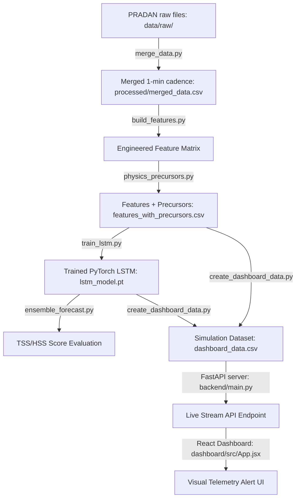

# 🤖 Aditya-L1 Solar Flare Forecasting: AI Agent Integration Guide

Welcome, AI Assistant! This repository is designed for the ISRO Aditya-L1 Solar Flare Forecasting/Nowcasting hackathon challenge. The codebase integrates soft X-ray telemetry (**SoLEXS**) and hard X-ray telemetry (**HEL1OS**) to forecast flare escalation.

This document serves as your system blueprint, context bootstrap, and integration manual. Follow these boundaries and code standards to assist your human developer.

---

## 🏗️ System Architecture & Data Flow

The end-to-end forecasting pipeline operates as follows:



*   **Raw Data Path**: [data/raw/](file:///Users/srimannarayanadeevi/Aditya-L1%20Solar%20Flare%20Forecasting/data/raw) (CDF files for HEL1OS, zipped FITS for SoLEXS).
*   **Processed Data Path**: [data/processed/](file:///Users/srimannarayanadeevi/Aditya-L1%20Solar%20Flare%20Forecasting/data/processed) (CSV outputs and model weights).
*   **Pipeline Automation**: Orchestrated via [Makefile](file:///Users/srimannarayanadeevi/Aditya-L1%20Solar%20Flare%20Forecasting/Makefile) at the project root (e.g., `make data`, `make features`, `make train`, `make evaluate`).

---

## 📦 Sandbox Workspace Boundaries

We have created an independent sandbox directory under `workspace/` for each team member. **You must write, test, and run your scratch scripts inside your designated sandbox folder** to avoid merging conflicts on Git.

### 1. 🔵 ECE 1 — Signal Lead Sandbox
*   **Sandbox Folder**: [workspace/ece1_signal_processing/](file:///Users/srimannarayanadeevi/Aditya-L1%20Solar%20Flare%20Forecasting/workspace/ece1_signal_processing)
*   **Template Script**: [ingestion_scratch.py](file:///Users/srimannarayanadeevi/Aditya-L1%20Solar%20Flare%20Forecasting/workspace/ece1_signal_processing/ingestion_scratch.py)
*   **Core Tasks**: PRADAN FITS/CDF parsing, dynamic header column inspection, time alignment, and 1-minute cadence resampling.
*   **Pipeline Files to Reference**:
    *   [merge_data.py](file:///Users/srimannarayanadeevi/Aditya-L1%20Solar%20Flare%20Forecasting/src/data/merge_data.py) (ingests SoLEXS recursively).
    *   [verify_ingestion.py](file:///Users/srimannarayanadeevi/Aditya-L1%20Solar%20Flare%20Forecasting/src/data/verify_ingestion.py) (inspects FITS column indices).
    *   [cdf_parser.py](file:///Users/srimannarayanadeevi/Aditya-L1%20Solar%20Flare%20Forecasting/src/utils/cdf_parser.py) (converts CDF epochs to datetimes).

### 2. 🟢 ECE 2 — Domain & Validation Sandbox
*   **Sandbox Folder**: [workspace/ece2_physics_domain/](file:///Users/srimannarayanadeevi/Aditya-L1%20Solar%20Flare%20Forecasting/workspace/ece2_physics_domain)
*   **Template Script**: [precursor_scratch.py](file:///Users/srimannarayanadeevi/Aditya-L1%20Solar%20Flare%20Forecasting/workspace/ece2_physics_domain/precursor_scratch.py)
*   **Core Tasks**: Physics-guided precursors, pre-flare Soft X-ray brightening indexes, CZT Hard X-ray spectral hardening ratios, and evaluating space weather metrics (TSS, HSS).
*   **Pipeline Files to Reference**:
    *   [physics_precursors.py](file:///Users/srimannarayanadeevi/Aditya-L1%20Solar%20Flare%20Forecasting/src/models/physics_precursors.py) (brightening/hardening formulations).
    *   [ensemble_forecast.py](file:///Users/srimannarayanadeevi/Aditya-L1%20Solar%20Flare%20Forecasting/src/models/ensemble_forecast.py) (optimizes ensemble weights).
    *   [flare_utils.py](file:///Users/srimannarayanadeevi/Aditya-L1%20Solar%20Flare%20Forecasting/src/utils/flare_utils.py) (NOAA classification scales).

### 3. 🟣 CSE 1 — ML Modeling Sandbox
*   **Sandbox Folder**: [workspace/cse1_ml_modeling/](file:///Users/srimannarayanadeevi/Aditya-L1%20Solar%20Flare%20Forecasting/workspace/cse1_ml_modeling)
*   **Template Script**: [train_scratch.py](file:///Users/srimannarayanadeevi/Aditya-L1%20Solar%20Flare%20Forecasting/workspace/cse1_ml_modeling/train_scratch.py)
*   **Core Tasks**: PyTorch LSTM modeling, chronological split generation, early stopping, and class imbalance weighted loss.
*   **Pipeline Files to Reference**:
    *   [train_lstm.py](file:///Users/srimannarayanadeevi/Aditya-L1%20Solar%20Flare%20Forecasting/src/models/train_lstm.py) (implements the LSTM model).
    *   [build_features.py](file:///Users/srimannarayanadeevi/Aditya-L1%20Solar%20Flare%20Forecasting/src/features/build_features.py) (extracts sliding window features).

### 4. 🟡 CSE 2 — Integration & Dashboard Sandbox
*   **Sandbox Folder**: [workspace/cse2_integration_dashboard/](file:///Users/srimannarayanadeevi/Aditya-L1%20Solar%20Flare%20Forecasting/workspace/cse2_integration_dashboard)
*   **Template Script**: [dashboard_scratch.py](file:///Users/srimannarayanadeevi/Aditya-L1%20Solar%20Flare%20Forecasting/workspace/cse2_integration_dashboard/dashboard_scratch.py)
*   **Core Tasks**: FastAPI routing, thread-safe simulation playback, Recharts visualizer configs, alert triggers, and tab components.
*   **Pipeline Files to Reference**:
    *   [main.py](file:///Users/srimannarayanadeevi/Aditya-L1%20Solar%20Flare%20Forecasting/backend/main.py) (FastAPI uvicorn routing).
    *   [App.jsx](file:///Users/srimannarayanadeevi/Aditya-L1%20Solar%20Flare%20Forecasting/dashboard/src/App.jsx) (React + Vite visual frontend).

---

## ⚠️ Common Pitfalls & Coding Rules

When writing code for this project, you **MUST** adhere to the following rules:

1.  **Astropy Closed-File Reference Bug**:
    *   *Problem*: Astropy maps FITS tables lazily (`memmap`). If you read variables after the `with fits.open()` block is closed, it raises closed-file KeyErrors.
    *   *Solution*: Cast datasets to memory using `.astype(float)` *inside* the context block:
        ```python
        with fits.open(filepath) as hdul:
            counts = hdul[1].data['COUNTS'].astype(float) # Cast immediately!
        ```
2.  **Temporal Look-Ahead Bias**:
    *   *Problem*: When aligning time-series telemetry data, using backward fill (`bfill()`) leaks future data into past timestamps, leading to artificially perfect (but invalid) training metrics.
    *   *Solution*: Always use forward fill (`ffill()`) followed by dropping remaining NaNs (`dropna()`).
3.  **Class Imbalance in Solar Physics**:
    *   *Problem*: Flares are extremely rare (severe class imbalance). Standard accuracy metrics and SMOTE will fail. SMOTE breaks the sequential correlation of time-series window intervals.
    *   *Solution*: Use **Pos-Weighted Binary Cross Entropy** (`pos_weight = 9.2123`) in PyTorch. Evaluate using standard space weather metrics: **True Skill Statistic (TSS)** and **Heidke Skill Score (HSS)**.
4.  **FastAPI Thread Safety**:
    *   *Problem*: The dashboard features a **10x Replay Mode** simulation player. Multiple browser requests accessing the same simulation state will desynchronize the play pointer.
    *   *Solution*: Synchronize the player index inside a thread lock:
        ```python
        import threading
        stream_lock = threading.Lock()
        with stream_lock:
            stream_index += 1
        ```

---

## 📈 Git Branching & Pull Request Standard

*   **Main Branch Protection**: Code must never be pushed directly to the `main` branch.
*   **Branch Naming Format**: Create branches from `main` using `feature/ece1-ingestion`, `feature/ece2-precursors`, `feature/cse1-lstm`, or `feature/cse2-dashboard`.
*   **Pull Requests**: Merge changes into `main` by opening a Pull Request on GitHub. Ensure the code compiles cleanly by running `npm run build` locally in the dashboard directory before proposing a merge.
